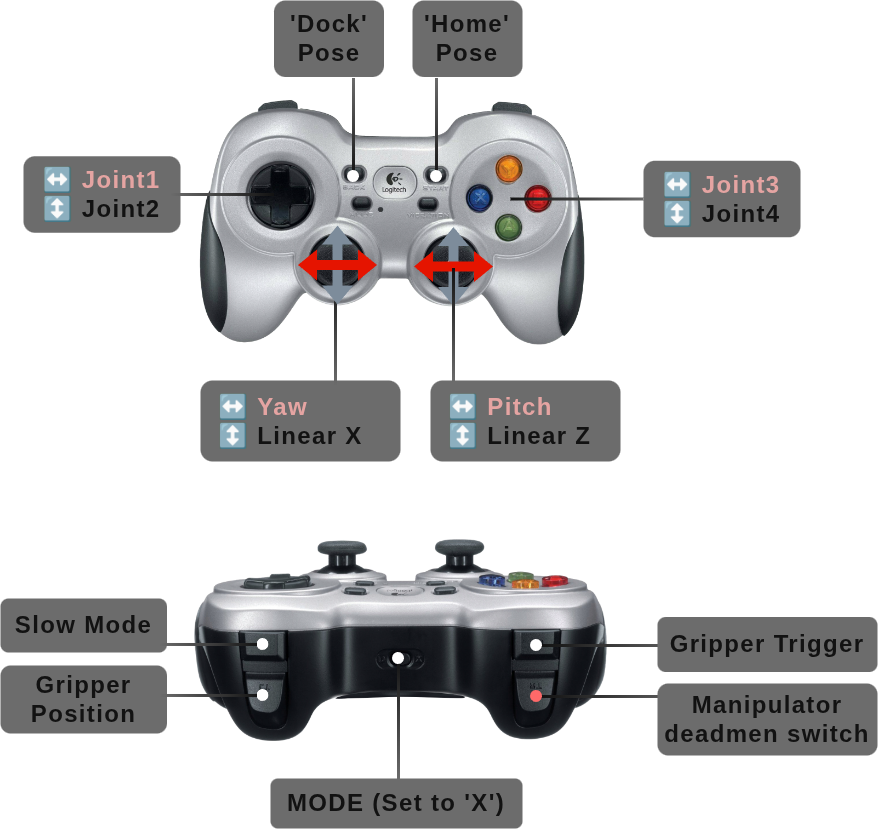

# ROSbot XL Manipulation

> [!WARNING]
> **Limitations**
>
> 1. **Before starting driver!** Make sure the manipulator is **undock**, manipulator is **away from a collision** (does not rest on robot objects) and **joints are away from its position limits** (e.g. one of the joints is started from extreme position).
> 2. Controlling MoveIt and via the joystick are two independent processes. You should not send commands to both of these services at the same time.
> 3. When the power supply is lost, the robot loses momentum and falls by inertia. Therefore, you should hold the manipulator when the power is cut off, or call the docking node `ros2 run open_manipulator_x_moveit dock` or press `RT` + `Back` buttons on gamepad.
> 4. To improve the range of the manipulator's movements. The robot's URDF has hardcoded that the antenna is set at 90 degrees. It is a good idea to position the antenna in the same way on the physical robot.
> 5. In the event of overload, loss of communication or sudden stopping of the manipulator process (e.g. during reboot), some joints may not receive the command to stop operation. This may prevent re-establishing communication. In such a case, it will be necessary to **reset the power supply**.

Below is a handful of the most important information for the ROSbot Manipulation/Manipulation PRO package.

## Control

After starting, the manipulator should be in the Home position after a few seconds. Now you can control ROSbot XL and OpenMANIPULATOR-X using a gamepad or RViz.

> [!NOTE]
> The instructions presented are for the Jazzy version. You can check the difference in versions by changing the branch in the [rosbot_ros/MANIPULATOR.MD](https://github.com/husarion/rosbot_ros/blob/jazzy/MANIPULATOR.md) repository.

### Gamepad

After running the ROSbot XL Manipulation Package, you should be able to control the manipulator. The easiest way to move the manipulator is to connect a gamepad and steer the robot. The graphic below shows how to steer the manipulator using a gamepad.



Gamepad controls are defined in the `config` directory in the [`joy_servo.yaml`](https://github.com/husarion/open_manipulator_x/blob/humble/open_manipulator_x_joy/config/joy_servo.yaml) (manipulator) and [`joy2twist.yaml`](rosbot_joy/config/joy.yaml) (ROSbot XL). Feel free to adjust them to your preference.

You may have noticed that the movement of the manipulator is slow, and the full capabilities of the manipulator are not fully utilized. This is a safety precaution to ensure that the collision checker effectively prevents the manipulator from bumping into the robot.
The dynamic limits of the manipulator have been tuned in order to provide a reliable collision prevention mechanism. While this setup should cover most situations, there is still a possibility of accidental contact with the robot or its sensors. Therefore, we advise you to remain aware of this potential risk when operating the manipulator.

### RViz Moveit

To move the manipulator using RViz, you need to build the code first. Then run:

```bash
ros2 launch open_manipulator_x_moveit rviz.launch.py
```

After that, RViz with the Moveit configuration will appear.


It is also possible to control the manipulator in the RViz using the *MotionPlanning* plugin. You can move the end effector by dragging the green marker and then click the `Plan & Execute` button to make the manipulator execute the motion. You may notice that the end effector doesn't follow the marker exactly, and to get Z rotation you have to use the blue ring - this is due to insufficient degrees of freedom of the manipulator, which causes some of the configurations to not be achievable.

> [!TIP]
> If you're not able to move the end effector in the Rviz, make sure that you have enabled the *Approx IK Solutions* option.
> If the manipulator moves too slowly, you can increase *Velocity Scaling* and *Accel. Scaling* up to `1.0`.

## Helpful Resources

### Resetting the Manipulator

In some situations it may be necessary to manually move the manipulator out of an invalid configuration.
To do it, first you will have to disable the torque of the manipulator, for example using the service.
On your ROSbot XL execute. **Hold the manipulator** while doing it, as it disables the torque and the manipulator can fall.

```bash
sudo rosbot.arm-disactivate
```

Now you can manually move the manipulator to the desired position and launch:

```bash
sudo rosbot.arm-activate
```

### Modifications

For more advanced purpose you may want to change default **manipulator position** or edit dynamixel **servo setting**. To do this it will be necessary to build [`rosbot_ros`](https://github.com/husarion/rosbot_ros/) and for:

1. Manipulator position
   - change position of the manipulator in the [`rosbot_xl.urdf.xacro`](https://github.com/husarion/rosbot_ros/blob/jazzy/rosbot_description/urdf/rosbot_xl.urdf.xacro)
   - regenerate collision matrix using [MoveIt Setup Assistant](https://moveit.picknik.ai/main/doc/examples/setup_assistant/setup_assistant_tutorial.html)

2. Servo setting
   Check/change some servo parameters in [Dynamixel Wizard 2.0](https://emanual.robotis.com/docs/en/software/dynamixel/dynamixel_wizard2/).

### Troubleshooting

- **Gripper does not move** - it could be caused by the wrong initial position. Turn off the torque as described in the [**Resetting the manipulator**](/tutorials/ros-projects/rosbot-xl-openmanipulator-x/#resetting-the-manipulator). Now manually rotate the hub of the manipulator servo 180 degrees (if the connecting rod of the left finger was below the right finger's one, the hub should be rotated so that it is above). Now once again launch controllers.
- **Manipulator stopped moving** - it can be too close to collision or singularity (you can verify it by examining console logs). The easiest solution to this problem is to return the manipulator to the *Home* position (`RT` + `Start` button).
- **Manipulator stopped moving and *Start* button does not work** - if the manipulator still won't move, it could be already in the collision (you can verify it by examining console logs). In this case, follow the [**Resetting the manipulator**](/tutorials/ros-projects/rosbot-xl-openmanipulator-x/#resetting-the-manipulator) step and return it manually to some valid position. If nothing helps try restart power supply.
